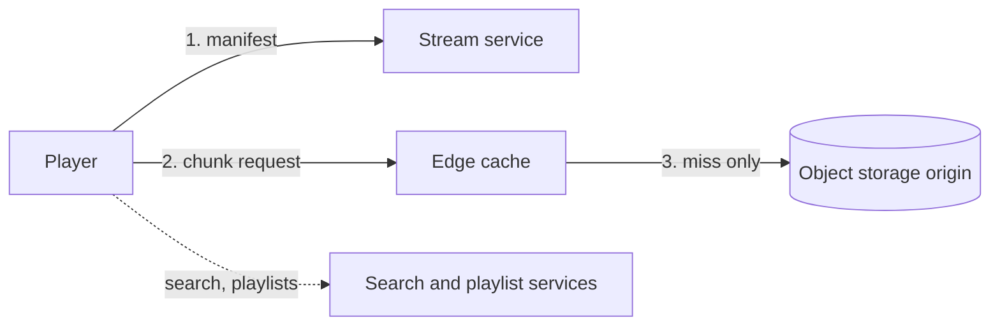

# c06: Spotify — Cut songs into chunks, serve them from the edge, and trade audio quality for capacity when the crowd arrives

Case studies · c05 → **c06** → c07

> *"The catalog is small and the audience is huge, so move the bytes to the listener"*
>
> **Concern**: latency · cost

## The Problem

A superstar drops a surprise album at midnight and 50 million fans press play at once. If the system sends whole 5 MB songs from one data center, the demand is far beyond any link. Without a CDN the origin melts. Without chunking, playback waits for a whole file. Without adaptive bitrate, someone on a weak connection waits 30 seconds or more.

The vault note's requirements: search under 200 ms, playback starting in under 1 second, 100 million songs, 500 million users, 20 million concurrent streams, 99.9% availability and a global latency under 150 ms.

## The Idea

Audio is small, popular, and identical for everyone who plays it, so it is the ideal thing to cache close to people. The design cuts each song into short chunks (10 to 15 seconds), stores several bitrates, and lists the chunks in a manifest. Players fetch chunks from a nearby edge server and pre-buffer 30 to 60 seconds ahead. The origin sees only the misses.



## How It Works

The sim runs one delivery calculation four times with different inputs. The core is this function:

```js
// sim.mjs
function outcome({ streams, kbps, hitPct, edges }) {
  const demandTbps = (streams * kbps) / 1e9;
  const hit = hitPct / 100;
  const gbPerHour = (demandTbps * 1000 / 8) * 3600;
```

1. **Constraints.** 20 million concurrent streams at an average of 192 kbps need 3.84 Tbit/s. With no CDN that all comes from the origin, costs $138K an hour at $0.08 per GB, and playback starts in about 200 ms.
2. **The v1 component.** 150 edge locations cache the chunks and 94% of requests hit. The origin drops to 0.23 Tbit/s, each edge runs at about 26% of a 100 Gbit/s link, playback starts in 30.8 ms (20 ms from the edge, 200 ms from the origin), and the hourly bandwidth bill falls to $25K.
3. **Catalog data is small.** The note sizes the audio store at 14.25 PB with replication and growth, but the playlists (about 1.3 PB in Cassandra) and the song catalog (about 1 TB in PostgreSQL) are separate concerns that do not touch the delivery path.
4. **Why chunks help twice.** A 10 to 15 second chunk is a small, identical file for everyone who plays that song, so the edge can cache it after the first request, and the player can start after the first chunk instead of the whole 5 MB. Pre-buffering 30 to 60 seconds ahead hides a slow chunk fetch.
5. **Why the hit rate matters so much.** The origin load is demand times the miss rate, so moving from 94% to 98% hits cuts origin traffic by two thirds. At 20 million streams, that is the difference between 0.23 and 0.08 Tbit/s.

## When It Breaks

Now grow concurrent listeners 10x: 200 million streams need 38.4 Tbit/s. The hit rate stays 94% but the edges are the wall: the same 150 edges would each be asked for 256% of their link. The origin sees 2.3 Tbit/s of misses, ten times its earlier load. A CDN moves the bottleneck from the origin to the edge; it does not remove it.

## The Trade-off

There are two levers, and each costs something.

- **Adaptive bitrate downshift:** move everyone from 192 to 128 kbps and demand falls to 25.6 Tbit/s. The price is lower audio quality, felt by everyone at once.
- **Cache warming:** pre-load the new release on the edges before it drops. The sim assumes 98% hits, cutting the origin to 0.51 Tbit/s and start time to 23.6 ms. The price is the pre-loading effort and the guess about what will be popular.

These levers combine rather than compete, and they do not remove the need for capacity. Even with both, holding edges at 80% of link capacity takes 320 edges, not 150. Without the downshift it would take 480. The bill is $131K an hour at this scale.

*Note: the 98% warmed hit rate, the 80% planned edge utilisation, and the 128 kbps downshift are assumptions of the sim. The vault note gives the 94% hit rate, the 150 edges of 100 Gbit/s and the CDN and origin prices. Cost counts bandwidth only.*

## In The Wild

The vault note cites Spotify's real stack and treats the CDN as non-negotiable: eight times cheaper per GB than the origin, ten times faster to first byte, and the only way to survive a release spike. It reports a production cache hit rate above 90% as the target on its dashboard.

## Try It

```sh
node course/7_case_studies/c06_spotify/sim.mjs --growth=10
```

You should see four frames. The first reports `demandTbps=3.84  originTbps=3.84  edgesUsed=0  edgeUtilPct=0  avgKbps=192  startMs=200  egressCostKPerHour=138`. The third reports `demandTbps=38.4  originTbps=2.3  edgesUsed=150  edgeUtilPct=256`, and the fourth reports `edgesUsed=320  edgeUtilPct=80  avgKbps=128`. Try `--cdnHitPct=80` to see the origin load grow, or `--downshiftKbps=64` to see how low quality has to go.

## Say It In The Interview

1. Size it: 20M concurrent streams times 192 kbps is 3.84 Tbit/s, so a single origin is impossible.
2. Chunk the audio, cache chunks on a CDN, pre-buffer, and let the player choose the bitrate.
3. Keep search, playlists and catalog off the delivery path.
4. For a release spike, name the two levers: warm the caches and downshift the bitrate, and say what each costs.

## Boundary

This chapter covers audio delivery and its capacity. Recommendation models (Discover Weekly), offline DRM and the search index are mentioned in the vault note but not modelled here. Video is c09.

## What's Next

Music is one-way: many listeners, one source. Editing a document together is many-to-many with strict ordering, where the bottleneck is one document, not bandwidth. That is Google Docs: c07.

## Source notes

- [Design Spotify](../../../vault/system_design/05_case_studies/design_spotify.md)
