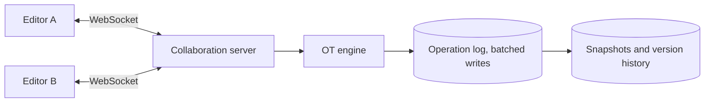

# c07: Google Docs — Order every document's edits in one place, batch the writes, and cap how many people can type at once

Case studies · c06 → **c07** → c08

> *"Everyone writes at once, so someone must decide the order"*
>
> **Concern**: consistency · latency

## The Problem

You and a colleague edit the same paragraph. You write for ten minutes while she deletes the section you are in. When the network catches up, one of you loses your work. The system has to merge simultaneous edits so every screen ends up identical, lose nothing, and show each change within about 100 ms.

The vault note's numbers: 50 million daily users, 5 billion documents, 3 to 5 editors per document on average with peaks above 100, and 10 to 50 keystrokes a second in an active document. A typical document is 50 KB.

## The Idea

Give each document one owner: a collaboration server that receives every edit for that document over a WebSocket, orders them, transforms each one against edits it did not know about (operational transformation, or OT; CRDTs are the alternative), and broadcasts the result. Because one machine sees the total order for a document, everyone converges.



## How It Works

The capacity model follows the vault note step by step. These lines set the load and the fleet:

```js
// sim.mjs
  const opsRps = users * EDITS_PER_SEC;
  const procServers = Math.ceil((opsRps * OP_MS) / 1000 / OPS_PER_PROC_SERVER);
  const wsServers = Math.ceil(users / WS_PER_SERVER);
  const dbNodes = Math.ceil(opsRps / batch / DB_WRITES_PER_NODE);
```

1. **Constraints.** 10% of 50 million users type at peak: 5 million people, each making one 500-byte edit a second. That is 5,000,000 operations a second and 60 Gbit/s of traffic to broadcast each edit to the other 2 editors.
2. **Naive persistence.** Writing every edit on its own at 200 writes a second per node needs 25,000 database nodes and about $16,167K a month.
3. **The v1 component.** 500 WebSocket servers hold the connections (10,000 each). Edits are persisted in batches of 100, which needs 250 database nodes. An edit takes 13 ms: 1 ms to transform, 5 ms to persist, 2 ms to broadcast, and 5 ms waiting for its batch to fill. The fleet costs about $500K a month, the vault note's estimate.

## When It Breaks

Growth by 10x is easy to see and easy to buy: 5,000 WebSocket servers, 2,500 database nodes and about $5,001K a month. Every added user brings one more connection and one more write, and those spread across machines.

The document is different. One server orders one document, and at 8 ms per operation a server can order about 125 operations a second for it. A document with 100 editors typing once a second is at 80% of that. Grow the crowd 10x to 1,000 editors and the load is 800%, and the broadcast is quadratic: each of 1,000 editors' edits goes to the other 999, or 999,000 messages a second. Adding servers does not help, because the document cannot be split without giving up the total order.

## The Trade-off

The chosen limit is a cap on simultaneous typists, with everyone else joining as view-only. With the cap at 100 the busy document is back at 80% load and 9,900 messages a second. Nobody loses an edit. The price is that the 900 extra people cannot type, and the design keeps one owner per document instead of a fully distributed model.

A CRDT can spread ordering across replicas and supports offline editing well, but it carries metadata per character and is harder to bound. The vault note discusses both; this chapter chose the central-order model and priced its ceiling.

The other trade-off is batching. It cuts the database from 25,000 nodes to 250, and the price is 5 ms of waiting and a small window of edits that are acknowledged but not yet durable.

*Note: the sim's $633 per server-month (the note's $500K spread over about 790 servers), the batch-fill wait, the 125-operations-a-second ceiling per document (1000 ms divided by 8 ms), the assumption that a document is ordered by one server, and the 100-editor cap are assumptions. The vault note gives the load figures, the per-operation timings and the server counts, and mentions 100+ simultaneous editors as a requirement. It does not price a cap.*

## In The Wild

The vault note describes Google's approach with an operation log plus snapshots, and lists version history, presence (cursors) and offline sync as features on top of the core. Snapshots every 100 operations keep replay short, adding about 2.5 TB a day beside 2.5 TB of operations.

## Try It

```sh
node course/7_case_studies/c07_google_docs/sim.mjs --growth=10
```

You should see four frames. The second reports `opsRps=5000000  wsServers=500  dbNodes=250  bandwidthGbps=60  opLatencyMs=13  hotDocLoadPct=80  hotDocFanoutRps=9900  monthlyCostK=500`. The third shows `hotDocLoadPct=800  hotDocFanoutRps=999000`, and the fourth brings them back to 80 and 9900. Try `--batch=1` to see 25,000 nodes and the latency fall to 8 ms, or `--editorCap=200` to see a bigger cap.

## Say It In The Interview

1. Start with the conflict problem, then choose OT or a CRDT and say why: a central server orders each document.
2. Keep one WebSocket per editor and route every edit for a document to the same server.
3. Persist as an operation log with periodic snapshots, and batch writes to keep the database small.
4. Name the hot-document limit yourself and give the cap or view-only mode as the answer.

## Boundary

This chapter covers collaboration capacity and ordering. The OT and CRDT algorithms in detail, presence, permissions and version history UI are outside it. Drill it interactively in the Google Docs case in the gym.

## What's Next

Documents are many-to-many messages of a few hundred bytes. Video meetings are many-to-many streams of megabits, and the bottleneck moves from ordering to bandwidth. That is Zoom: c08.

## Source notes

- [Design Google Docs](../../../vault/system_design/05_case_studies/design_google_docs.md)
