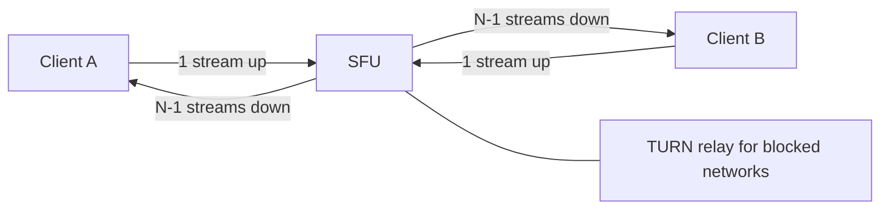

# c08: Zoom — Forward video instead of meshing or mixing it, and show each person only the tiles they can use

Case studies · c07 → **c08** → c09

> *"Send each stream once, and let the server decide who needs it"*
>
> **Concern**: latency · scalability

## The Problem

Your video app is fine with three people. You launch, and 50 people join one call. In a peer-to-peer mesh every browser sends its video to the 49 others at once: 245 Mbit/s of upload, which no home connection has. Calls freeze and users leave.

The vault note's requirements: 1-on-1 and group calls up to 1,000 people, screen sharing, recording, delay under 150 ms (past 300 ms a conversation feels unnatural), and 300 million daily participants.

## The Idea

Put a media router in the middle. A **selective forwarding unit (SFU)** receives one stream from each person and forwards copies to the others without decoding or mixing. Each person uploads once, and simulcast (three quality versions of the stream) lets the SFU pick what each receiver can handle. The alternative, a **multipoint control unit (MCU)**, decodes and mixes everything into one picture: cheap for clients but expensive in server CPU and about 200 ms slower.



## How It Works

Two small functions carry the model: the mesh, and the SFU with its per-server capacity.

```js
// sim.mjs
function sfu(n, up, streams, peakUsers) {
  const down = streams * RECEIVE_MBPS;
  const meetingMbps = n * up + n * down;
  const perServer = (NIC_MBPS / meetingMbps) * n;
  const servers = Math.ceil((peakUsers / perServer) * SPARE);
```

1. **Constraints.** In a 10-person mesh each person uploads 9 copies of a 5 Mbit/s stream: 45 Mbit/s, and the cost grows with the square of the call size.
2. **The v1 component.** With an SFU each person uploads 5 Mbit/s and receives 9 streams of 1.5 Mbit/s, which is 13.5 Mbit/s. A meeting moves 185 Mbit/s through the server. A 10 Gbit/s network card serves 540.5 people, so 28.1 million peak participants need 67,581 SFU servers with 30% spare, about $38M a month. That matches the vault note's 67,648 servers and $38M.
3. **The bottleneck is bandwidth, not CPU.** Forwarding packets is cheap; the network card fills first.

4. **Why simulcast.** The sender encodes three versions of its video (the note gives 3, 1.5 and 0.5 Mbit/s, which is where the 5 Mbit/s upload comes from). The SFU picks one per receiver by that receiver's bandwidth, so a person on a weak network gets a low-quality stream without dragging everyone else down. The price is a larger upload for the sender.
5. **Why the receive figure is an average.** The 1.5 Mbit/s per received stream in the sim is the note's average across those quality levels, so a real meeting mixes larger and smaller streams. The shape of the result, which is quadratic growth in meeting size, does not depend on the exact figure.

## When It Breaks

Make the meeting 10x larger, 100 people. An SFU forwards 99 streams to each person: 148.5 Mbit/s of download per person, more than many home connections give, and 15,350 Mbit/s for one meeting. That does not even fit on one 10 Gbit/s server: a server holds only 65.1 people, and the fleet needs 560,736 servers, about $315M a month. That is 8.3x the baseline fleet, because the download per person grows with the number of others, so the traffic grows with the square of the meeting size. At the note's maximum of 1,000 people (`--meetingSize=50 --growth=20`), a server holds 6.7 people and the fleet is 5.5 million servers.

## The Trade-off

Nobody can look at 99 people at once, so send them fewer. Gallery view sends each client at most 9 tiles. Per-person download is back to 13.5 Mbit/s, a server holds 540.5 people again and the fleet is 67,581 servers, about $38M: the same as the 10-person meeting.

The price is that 90 people in a 100-person meeting are not on screen. An active-speaker rule decides who is shown, so the choice of tiles becomes a product decision as much as a systems one, and a wrong choice hides the person who is talking.

*Note: the sim's 50 ms mesh latency, the mesh sending and receiving full 5 Mbit/s streams, the fractional participants per server for very large meetings, the 9 tiles and counting only media servers are assumptions. The vault note also plans about 562 signalling, 2,800 TURN and 28,100 recording servers, which the sim leaves out, so its total of 99,110 servers is larger than the sim's fleet. The 67,581 in the sim is 67 fewer than the note's 67,648 because the sim does not round meetings per server down to whole meetings.*

## In The Wild

The vault note says Zoom uses an SFU with simulcast rather than SVC (one layered stream), which had limited browser and codec support. It also plans a TURN relay fallback for 5 to 10% of connections and estimates bandwidth of about 520 Tbit/s at peak, then notes that peering agreements, not list-price transit, make that affordable.

## Try It

```sh
node course/7_case_studies/c08_zoom/sim.mjs --growth=10
```

You should see four frames. The first reports `clientUpMbps=45  clientDownMbps=45  servers=0`. The second reports `meetingMbps=185  participantsPerServer=540.5  servers=67581  monthlyCostM=38  latencyMs=100`. The third reports `clientDownMbps=148.5  meetingMbps=15350  participantsPerServer=65.1  servers=560736  monthlyCostM=315.2`, and the fourth returns to `servers=67581`. Try `--tiles=25` to see what a bigger gallery costs.

## Say It In The Interview

1. Compare the three architectures: mesh needs N-1 uploads, an MCU is CPU-heavy and slow, an SFU forwards and scales.
2. Choose an SFU with simulcast, over UDP and WebRTC, with a TURN fallback and signalling on WebSockets.
3. Size the fleet from the network card, not the CPU: about 540 people per 10 Gbit/s server.
4. Bound the cost of large meetings with a gallery limit and active-speaker selection, and say who is hidden.

## Boundary

This chapter covers meeting capacity and forwarding. Codecs, echo cancellation, recording pipelines and encryption are outside it. Video-on-demand streaming, which can be cached, is c09.

## What's Next

Zoom sends live streams, which nothing can cache in advance. Video on demand can be cached, chunked and delivered from the edge. That is video streaming: c09.

## Source notes

- [Design Zoom](../../../vault/system_design/05_case_studies/design_zoom.md)
