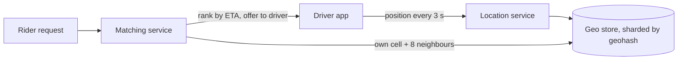

# c10: Ride Sharing — Find the nearest driver among millions of moving dots

Case studies · c09 → **c10** → c11

> *"The matching is easy; keeping two million positions fresh is the hard part"*
>
> **Concern**: scalability · latency · consistency

## The Problem

A rider taps "request". Within about 10 seconds the system must pick a nearby driver, and it knows where every driver is only because each one reports a GPS position every 3 seconds. The vault note puts numbers on it: 10 million rides a day, 2 million active drivers, and a payment step that must stay consistent.

Two questions decide the design. How do you find drivers near a point without comparing against everyone? And how do you absorb the constant stream of positions without the store falling over?

## The Idea

Split the world into **geohash** cells. A geohash turns latitude and longitude into a short string where nearby places share a prefix, so a proximity search becomes a key lookup. The note's example: `9q8yyk8` is a spot in San Francisco and `9q8yyk` is the larger cell around it. Keep each driver under the key of the cell they are in, and shard the cells across store nodes.



A match reads the rider's cell and its 8 neighbours, because a driver just across a cell edge has a different prefix. Redis `GEORADIUS` does this in one command, and the note also lists quadtrees as an alternative.

## How It Works

The requirements decide which side is heavy:

1. **Matching is light.** 10M rides a day is about 116 requests a second.
2. **Location is heavy.** 2M drivers reporting every 3 seconds is 666,667 writes a second. At 200 bytes each, that is 1,067 Mbit/s coming in.
3. **One node cannot take it.** The sim assumes a store node handles 100,000 writes a second and keeps it under 70% busy, so the naive single store runs at 667% of capacity, and with no index a match would scan all 2,000,000 drivers.
4. **Sharding by geohash** turns both problems into small ones:

```js
// sim.mjs
const utilPct = (rps) => Math.round((rps / NODE_WRITES_RPS) * 100);
const nodesFor = (rps) => Math.ceil(rps / (NODE_WRITES_RPS * TARGET_UTIL));
```

That gives 10 shards at about 67% busy each, and a match ranks about 360 drivers (9 cells of 40) instead of 2 million.

The v1 design carries an assumption: the load spreads evenly across shards.

## When It Breaks

At 10x the drivers (a bigger city, a holiday, a stadium emptying) the updates rise to 6,666,667 a second, or 10,667 Mbit/s. Location writes do not spread evenly, because drivers gather where riders are. With 25% of the updates landing in one region, that region's shard is asked for 1667% of what it can write, while other shards sit idle. Adding shards does not help, because the hot cell is one key range. Matching also gets heavier: 1,157 requests a second, with about 3,600 candidates to rank per request.

## The Trade-off

Two moves fix the hot spot, and each costs something. **Split the hot region** across several shards with finer cells, here 15 shards for the hot region and 58 in all. And **update less often**: at every 5 seconds instead of 3, the writes fall from 6.7M to 4M a second. The busiest shard returns to 67%.

The price of the second move is freshness. A driver at 40 km/h moves 33 m between updates every 3 seconds and 55 m every 5, so ETAs are less accurate and the nearest driver on the map may no longer be the nearest on the road. Try `--slowUpdateSec=10`: the system needs only 30 shards, but a position can be 110 m old. The note's requirement of an update every 3 seconds is a business choice, and this dial shows what it costs.

*Note: the vault note does not give a node capacity, a driver speed, a drivers-per-cell count or the hot-region share. The sim assumes 100,000 writes a second per node, 11 m/s, 40 drivers per cell and 25%. Payments and trip state, which need strong consistency, are not simulated.*

## In The Wild

The vault note cites Uber at 23+ million rides a day, over 6 million drivers and more than 10,000 cities. Its capacity math uses 1.5 million concurrent drivers at peak, or 500,000 location writes a second, which is the same order of magnitude as this sim. The note also covers a cell-to-cell travel-time table for ETAs, about 1.6 GB per city, as an alternative to running a route search for each candidate.

## Try It

```sh
node course/7_case_studies/c10_ride_sharing/sim.mjs --slowUpdateSec=10
```

You should see four frames. The first reports `updatesRps=666667  matchRps=116  bandwidthMbps=1067  shards=1  hotShardUtilPct=667  candidatesPerMatch=2000000`, and the second `shards=10  hotShardUtilPct=67  candidatesPerMatch=360`. The failure frame shows `updatesRps=6666667  hotShardUtilPct=1667`. With `--slowUpdateSec=10` the last frame reads `updatesRps=2000000  shards=30  hotShardUtilPct=63  staleMeters=110`.

## Say It In The Interview

1. Do the numbers: 116 matches a second is small, 666,667 location writes a second is the problem.
2. Index by geohash and shard by region, and read the 9 neighbouring cells.
3. Name the hot-spot problem before the interviewer does: drivers cluster, so shards do not load evenly.
4. Offer the freshness trade-off: fewer updates, or splitting the hot region, at the cost of stale positions.
5. Say that payment and trip state are different: they need consistency, and belong in a database, not the location store.

## Boundary

This chapter covers the location stream and matching. ETA and routing are the next chapter's territory (c11), and payments belong to the drill case `payment-system`. Surge pricing is left out.

## What's Next

You have built a system around a point on a map. What about the map itself: billions of tiles and a road graph too large to search? Next: c11.

## Source notes

- [Design a ride sharing service](../../../vault/system_design/05_case_studies/design_ride_sharing.md)
