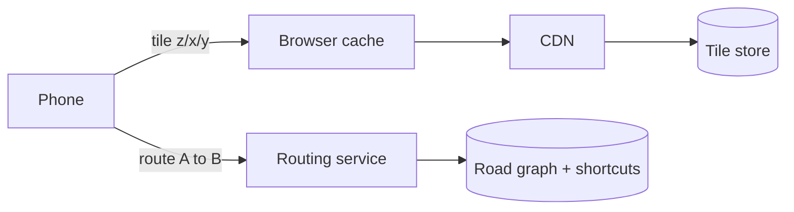

# c11: Google Maps — Pre-draw the map, pre-compute the shortcuts

Case studies · c10 → **c11**

> *"A map request should be a file fetch, and a route request should be a table lookup"*
>
> **Concern**: latency · scalability · cost

## The Problem

A startup builds a navigation app that draws each map on demand: fetch every road in the viewport from a database, render it, return an image. At 100 users it works. At 10,000 users a map takes 30 seconds to load, because each view generates about a thousand database queries and nothing is cached. Routes are worse: Dijkstra's algorithm over a billion road segments takes about 45 seconds per route.

The vault note asks for tiles in under 100 ms, routes in under 2 seconds, traffic refreshed every 30-60 seconds and 99.99% availability, for a billion daily users.

## The Idea

Split the work in two by how often the answer changes. The **map** changes rarely, so draw it once and store the pictures: pre-rendered **tiles**, each a small square of the world at one zoom level, fetched by coordinates and cached like any static file (b06, b07). The **route** depends on the two points you ask about, so you cannot cache answers, but you can pre-compute a structure that makes any search fast.



The note's routing answer is **contraction hierarchies**: pre-compute shortcut edges that skip minor streets, so a search climbs to the highways and comes back down, and it is described as about 1000x faster than plain Dijkstra.

## How It Works

The note's numbers: 1B daily users, 10 views a day, 15 tiles a view, so 150B tile requests a day.

```js
// sim.mjs
  const tileRps = viewsRps * tilesPerView * (1 - browserHit);
  const originRps = tileRps * (1 - cdnHit);
```

1. **Traffic.** That is 1,736,111 tile requests a second (the note says 1.7M) at 50 KB each, or 86.8 GB/s (the note says 85). Routes add 5,787 a second.
2. **Drawing on demand fails.** A 500 ms tile pulled from the database puts 1.7M requests a second on an origin the sim assumes can serve 200,000: 868% utilisation. Plain Dijkstra at 45 seconds a route keeps 260,417 cores busy.
3. **The v1 design pre-renders and caches.** The browser absorbs 80% of tile requests and the CDN 95% of the rest. Only 17,361 requests a second reach the origin, 9% of capacity, and the average tile takes 11 ms.
4. **Routing uses the hierarchy.** A route drops from 45,000 ms to 45 ms, and 261 cores cover the load.

## When It Breaks

Caches only work while the tiles they hold stay valid. Suppose you change the map style: new colours, new road widths. Raster tiles are pictures, so every tile is stale and the CDN hit rate falls (the sim uses 20%). If that lands on a day with 10x traffic, the origin is asked for 2,777,778 requests a second, or 1389% of its capacity. Egress reaches 173.6 GB/s.

Routing is not the problem here: 2,605 cores at 10x is a normal fleet. The cache is the bottleneck, and the sim shows it going wrong because of a change in data, not because of a spike in users. (Live traffic is a separate danger: the pre-computed shortcuts assume road weights that traffic changes, and the note says the hierarchy buys speed with heavy preprocessing.)

## The Trade-off

**Vector tiles** fix it. Instead of a picture, a tile carries road data, 30 KB instead of 50 in the note. The phone draws it with the current style. A restyle then changes only the phone's drawing code, so the CDN's 95% survives, the origin drops to 87% at 10x, and egress falls to 104.2 GB/s from 173.6.

What you pay is work moved to the client. The sim assumes 15 ms of drawing per tile set on every phone, which is cheap on a new phone and painful on an old one, and the app must ship drawing code that raster tiles never needed. The alternative is to keep raster tiles and pre-warm the CDN before the style change.

*Note: the vault note does not give an origin capacity, a routing core count, a drawing cost or the post-restyle hit rate. The sim assumes 200,000 requests a second, one core per route, 15 ms and 20%. It uses daily averages with no peak factor.*

## In The Wild

The note describes Google Maps as tiles behind a CDN with a 95%+ hit rate for popular city-centre tiles, a 500 TB tile set across zoom levels 0-18, and routing that combines contraction hierarchies with A*. It places the road graph at about 200 GB in memory for a billion segments, small enough to hold on a routing fleet.

## Try It

```sh
node course/7_case_studies/c11_google_maps/sim.mjs --coldHitPct=50
```

You should see four frames. The first reports `tileRps=1736111  originUtilPct=868  routeMs=45000  routeCores=260417`. The second reports `tileRps=347222  originRps=17361  originUtilPct=9  tileMs=11  routeMs=45  routeCores=261`. At the default 20% hit after a restyle the failure frame shows `originUtilPct=1389`, and at `--coldHitPct=50` it is 868%: a half-warm cache is still not enough. The last frame reads `originUtilPct=87  egressGBps=104.2  clientRenderMs=15`.

## Say It In The Interview

1. Do the estimate: 1.7M tile requests a second, about 85 GB/s, 5,800 routes a second.
2. Pre-render tiles by zoom, x and y, and serve them from object storage behind a CDN.
3. Name the cache layers with rough hit rates: browser 80%, CDN 95%.
4. For routing, say why plain Dijkstra fails and offer contraction hierarchies with A*.
5. Discuss vector versus raster tiles as a trade of bandwidth and cache stability against client CPU.

## Boundary

This chapter covers serving tiles and computing routes. Place search is the search chapter's ground (b10), and Street View imagery and turn-by-turn voice guidance are not covered. Fusing live traffic into routes is only touched on here.

## What's Next

That is the last chapter. You have taken a whole loop (constraints, a v1 design, what breaks, and the trade-off) through eleven real systems. The practice gym is where you run the loop on your own. Pick a drill case, design it, and get it reviewed, and use the Library when you want the full vault notes behind any chapter.

## Source notes

- [Design Google Maps](../../../vault/system_design/05_case_studies/design_google_maps.md)
